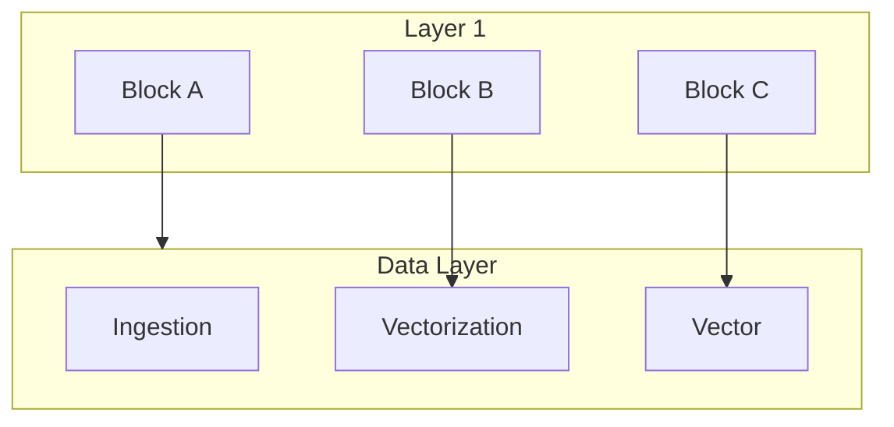
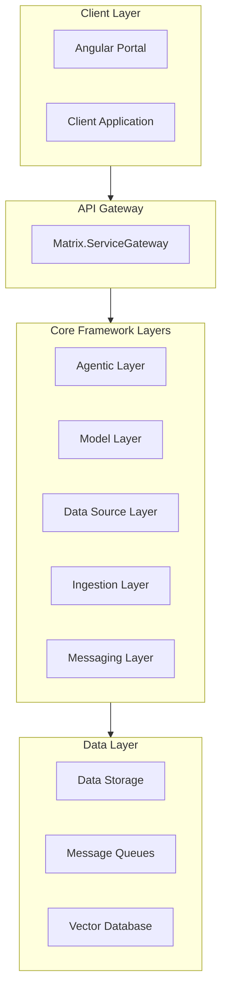

# Matrix

This repo provides a Agentic AI Framework 


# This is main title



## Components of Agentic AI Framework

- Task Management Tools
- Decision and Reasoning Tools
- Monitoring and Incident Tool Integration
- Security Tool Integration
- Compliance Tool Integration
- Content Generation
- Customer Interaction
- Resource Management in Cloud
- DevOps Automation
- Monitoring & Alerting
- Customer Personalization
- Predictive Maintenance
- Enterprise Data Integration

# Matrix Framework Documentation

## Overview
Matrix is a comprehensive Agentic AI Framework that provides enterprise-grade tools and services for building intelligent applications. The framework is built on .NET 8 and follows a modular, layered architecture pattern.

## Architecture

### High-Level Architecture Diagram


## Layer Documentation

### 1. Client Layer
**Assembly**: `Matrix.Portal`, `Client.csproj`

#### Portal Application (Matrix.Portal)
Modern Angular-based web application providing user interface for:
- Agent Management
- Data Source Configuration
- Model Registry
- System Monitoring

#### Client Application
.NET 8 client application for programmatic access to the framework.

### 2. API Gateway Layer
**Assembly**: `Matrix.ServiceGateway`

Primary entry point for all client-server communications:
- Request routing
- Authentication/Authorization
- Rate limiting
- Request/Response transformation
- Monitoring and logging

### 3. Agentic Layer
**Namespace**: `Matrix.AgenticLayer`

#### Core Components

##### AgentRegistry
**Assembly**: `Matrix.AgenticLayer.AgentRegistry`
```csharp
public interface IAgentRegistry
{
    Task<Agent> RegisterAgent(AgentRegistration registration);
    Task<Agent> GetAgent(string agentId);
    Task<IEnumerable<Agent>> GetAgents(AgentQuery query);
}
```

##### BaseAgent
**Assembly**: `Matrix.AgenticLayer.BaseAgent`
```csharp
public abstract class BaseAgent
{
    protected virtual Task Initialize();
    protected abstract Task Execute();
    protected virtual Task Cleanup();
}
```

##### AgentBuilder
**Assembly**: `Matrix.AgenticLayer.Builders`
```csharp
public interface IAgentBuilder
{
    IAgentBuilder WithCapability<T>() where T : IAgentCapability;
    IAgentBuilder WithConfiguration(AgentConfiguration config);
    Task<IAgent> BuildAsync();
}
```

### 4. Model Layer
**Namespace**: `Matrix.ModelLayer`

#### Core Services
- Model Registration
- Model Versioning
- Model Deployment
- Model Monitoring

#### Key Interfaces
```csharp
public interface IModelRegistry
{
    Task<Model> RegisterModel(ModelRegistration registration);
    Task<Model> GetModel(string modelId, string version);
    Task<IEnumerable<Model>> GetModels(ModelQuery query);
}
```

### 5. Data Source Layer
**Namespace**: `Matrix.DataSourceLayer`

Supports multiple data source types:
- Structured (Databases)
- Semi-structured (JSON, XML)
- Unstructured (Text, Documents)
- Multimedia (Images, Audio, Video)
- Streaming (Real-time data)
- Vector (Embeddings)

#### Key Interfaces
```csharp
public interface IDataSourceConnector
{
    Task<Connection> Connect(ConnectionParameters parameters);
    Task<QueryResult> ExecuteQuery(Query query);
    Task<StreamingResult> StreamData(StreamingParameters parameters);
}
```

### 6. Ingestion Layer
**Namespace**: `Matrix.IngestionLayer`

#### Components
1. **Chunking Service**
   - Document splitting
   - Context preservation
   - Metadata extraction

2. **Configuration Service**
   - Pipeline configuration
   - Processing rules
   - Validation rules

3. **Connectors**
   - Azure Search Integration
   - Custom source connectors

### 7. Messaging Layer
**Namespace**: `Matrix.MessagingLayer`

#### Core Components
1. **Messaging Engine**
   - Message routing
   - Event publication
   - Message transformation

2. **Azure Service Bus Connector**
   - Queue management
   - Topic subscription
   - Message filtering

## Framework Components

### 1. Task Management Tools
- Task scheduling
- Priority management
- Resource allocation
- Task monitoring

### 2. Decision and Reasoning Tools
- Rule engine integration
- Decision tree processing
- Inference engine
- Reasoning framework

### 3. Security Integration
- Authentication providers
- Authorization rules
- Data encryption
- Audit logging

### 4. Monitoring & Alerting
- Health checks
- Performance metrics
- Alert configuration
- Dashboard integration

### 5. Content Generation
- Template processing
- Multi-format support
- Version control
- Content validation

### 6. Enterprise Integration
- Data connectors
- Protocol adapters
- Transform mappings
- Integration patterns

## API Documentation

### RESTful Endpoints

#### Agent Management
```http
POST /api/agents
GET /api/agents
GET /api/agents/{id}
PUT /api/agents/{id}
DELETE /api/agents/{id}
```

#### Model Registry
```http
POST /api/models
GET /api/models
GET /api/models/{id}/versions/{version}
PUT /api/models/{id}
DELETE /api/models/{id}
```

#### Data Sources
```http
POST /api/datasources
GET /api/datasources
GET /api/datasources/{id}
PUT /api/datasources/{id}
DELETE /api/datasources/{id}
```

## Development Guide

### Prerequisites
- .NET 8 SDK
- Node.js 18+
- Angular CLI
- Azure subscription (optional)

### Project Structure
```
src/
├── Client/
├── Framework/
│   ├── AgenticLayer/
│   ├── ModelLayer/
│   ├── DataSourceLayer/
│   ├── IngestionLayer/
│   └── MessagingLayer/
└── Tests/
```

### Building
```powershell
dotnet build Matrix.sln
```

### Testing
```powershell
dotnet test Matrix.sln
```

## Deployment

### Infrastructure Requirements
- Azure App Service
- Azure SQL Database
- Azure Service Bus
- Azure Cognitive Search
- Azure Key Vault

### Configuration
```json
{
  "ServiceGateway": {
    "BaseUrl": "https://api.example.com",
    "ApiVersion": "v1"
  },
  "Authentication": {
    "Authority": "https://login.microsoftonline.com/",
    "Audience": "api://matrix"
  }
}
```

## Security

### Authentication
- Azure AD integration
- JWT token validation
- Certificate-based auth
- API key management

### Authorization
- Role-based access control
- Resource-based authorization
- Scope validation
- Claims transformation

## Best Practices

### Code Guidelines
- Follow C# coding conventions
- Use dependency injection
- Implement interface segregation
- Maintain loose coupling

### Testing Strategy
- Unit tests per component
- Integration tests
- Performance tests
- Security tests

### Logging
- Structured logging
- Correlation IDs
- Performance metrics
- Audit trails

## Support & Maintenance

### Monitoring
- Application Insights integration
- Custom metrics
- Alert rules
- Dashboard templates

### Troubleshooting
- Logging levels
- Diagnostic tools
- Health checks
- Error handling

## Version History
- v1.0.0 - Initial release
- v1.1.0 - Added vector database support
- v1.2.0 - Enhanced security features
