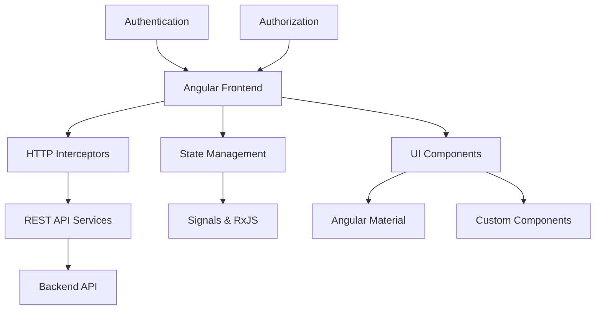

# Architecture Overview

High-level system architecture and design patterns for Matrix Portal.

## System Architecture

Matrix Portal follows a modern Angular architecture with clear separation of concerns and enterprise-grade patterns.



## Core Architectural Principles

### 1. Layered Architecture

```
┌─────────────────────────────────────────┐
│              Presentation Layer          │
│  (Components, Directives, Pipes)        │
├─────────────────────────────────────────┤
│              Business Logic Layer        │
│  (Services, Guards, Resolvers)          │
├─────────────────────────────────────────┤
│              Data Access Layer           │
│  (HTTP Services, Interceptors)          │
├─────────────────────────────────────────┤
│              External APIs               │
│  (REST APIs, Authentication)            │
└─────────────────────────────────────────┘
```

### 2. Component Hierarchy

```typescript
// Base component architecture
BaseComponent<T>
├── BaseListComponent<T>    // List operations
│   ├── AgentListComponent
│   ├── ModelListComponent
│   └── DataSourceListComponent
└── BaseDetailComponent<T>  // CRUD operations
    ├── AgentDetailComponent
    ├── ModelDetailComponent
    └── DataSourceDetailComponent
```

### 3. Service Architecture

```typescript
// Service layer organization
Core Services
├── HttpService              // HTTP communication
├── AuthService             // Authentication
├── NotificationService     // User notifications
└── ConfigService          // Configuration

Entity Services
├── AgentService           // Agent management
├── ModelService           // Model management
├── DataSourceService      // Data source management
└── ChunkService          // Chunk management

Utility Services
├── ValidationService      // Form validation
├── CacheService          // Data caching
└── LoggingService        // Application logging
```

## Design Patterns

### 1. Repository Pattern

```typescript
interface Repository<T> {
    getAll(): Observable<T[]>;
    getById(id: string): Observable<T>;
    create(item: T): Observable<T>;
    update(item: T): Observable<T>;
    delete(id: string): Observable<void>;
}

@Injectable()
export class AgentService implements Repository<Agent> {
    // Implementation with HTTP calls
}
```

### 2. Observer Pattern

```typescript
// Using Angular Signals for reactive state
@Injectable()
export class StateService {
    private agents = signal<Agent[]>([]);
    private loading = signal<boolean>(false);
    
    // Computed derived state
    activeAgents = computed(() => 
        this.agents().filter(agent => agent.status === 'Active')
    );
}
```

### 3. Strategy Pattern

```typescript
interface ValidationStrategy {
    validate(value: any): ValidationResult;
}

class EmailValidationStrategy implements ValidationStrategy {
    validate(email: string): ValidationResult {
        // Email validation logic
    }
}

class PasswordValidationStrategy implements ValidationStrategy {
    validate(password: string): ValidationResult {
        // Password validation logic
    }
}
```

## Module Organization

### Feature Modules

```
src/app/modules/
├── agents/
│   ├── agents-routing.module.ts
│   ├── agents.module.ts
│   ├── components/
│   └── services/
├── models/
│   ├── models-routing.module.ts
│   ├── models.module.ts
│   ├── components/
│   └── services/
└── core/
    ├── core.module.ts
    ├── guards/
    ├── interceptors/
    └── services/
```

### Shared Resources

```
src/app/shared/
├── components/
│   ├── base-components/
│   ├── ui-components/
│   └── layout-components/
├── services/
│   ├── base-services/
│   └── utility-services/
├── models/
├── guards/
├── pipes/
└── directives/
```

## Data Flow Architecture

### 1. Unidirectional Data Flow

```
User Action → Component → Service → HTTP → Backend
                ↓           ↓        ↓
            State Update ← Response ← API
                ↓
            UI Update
```

### 2. State Management

```typescript
// Signal-based state management
@Component({})
export class AgentListComponent {
    // Local component state
    private agents = signal<Agent[]>([]);
    private loading = signal<boolean>(false);
    
    // Computed properties
    displayAgents = computed(() => {
        const search = this.searchTerm();
        return this.agents().filter(agent => 
            agent.name.toLowerCase().includes(search.toLowerCase())
        );
    });
    
    // Effects for side effects
    constructor() {
        effect(() => {
            if (this.agents().length === 0 && !this.loading()) {
                this.loadAgents();
            }
        });
    }
}
```

## Security Architecture

### 1. Authentication Flow

```
Login Request → Auth Service → JWT Token → Local Storage
                     ↓
              HTTP Interceptor → Add Bearer Token → API Calls
```

### 2. Authorization Guards

```typescript
@Injectable()
export class RoleGuard implements CanActivate {
    canActivate(route: ActivatedRouteSnapshot): boolean {
        const requiredRoles = route.data['roles'];
        return this.authService.hasRole(requiredRoles);
    }
}
```

## Performance Architecture

### 1. Lazy Loading Strategy

```typescript
const routes: Routes = [
    {
        path: 'agents',
        loadChildren: () => import('./modules/agents/agents.module')
            .then(m => m.AgentsModule)
    }
];
```

### 2. Change Detection Optimization

```typescript
@Component({
    changeDetection: ChangeDetectionStrategy.OnPush
})
export class OptimizedComponent {
    // Use signals for automatic change detection
    data = signal<Data[]>([]);
}
```

## Error Handling Architecture

### 1. Global Error Handler

```typescript
@Injectable()
export class GlobalErrorHandler implements ErrorHandler {
    handleError(error: Error): void {
        // Log error
        // Show user notification
        // Report to monitoring service
    }
}
```

### 2. HTTP Error Interceptor

```typescript
@Injectable()
export class ErrorInterceptor implements HttpInterceptor {
    intercept(req: HttpRequest<any>, next: HttpHandler): Observable<HttpEvent<any>> {
        return next.handle(req).pipe(
            catchError(error => {
                // Handle different error types
                // Show appropriate user messages
                return throwError(() => error);
            })
        );
    }
}
```

## Testing Architecture

### 1. Testing Pyramid

```
              E2E Tests (10%)
            ─────────────────
           Integration Tests (20%)
         ─────────────────────────
        Unit Tests (70%)
       ─────────────────────────────
```

### 2. Test Organization

```
src/
├── app/
│   ├── components/
│   │   ├── component.ts
│   │   └── component.spec.ts
│   └── services/
│       ├── service.ts
│       └── service.spec.ts
├── e2e/
│   ├── page-objects/
│   └── specs/
└── test-utils/
    ├── mocks/
    └── fixtures/
```

## Deployment Architecture

### 1. Build Pipeline

```
Source Code → Build → Test → Package → Deploy
     ↓         ↓      ↓       ↓        ↓
   GitHub → Angular → Jest → Docker → Azure
```

### 2. Environment Strategy

```
Development → Staging → Production
     ↓          ↓         ↓
  localhost → staging.app → app.com
```

## Monitoring & Observability

### 1. Application Monitoring

- **Performance**: Core Web Vitals tracking
- **Errors**: Real-time error reporting  
- **Usage**: User analytics and behavior
- **Health**: Application health checks

### 2. Logging Strategy

```typescript
enum LogLevel {
    DEBUG = 0,
    INFO = 1,
    WARN = 2,
    ERROR = 3
}

@Injectable()
export class LoggingService {
    log(level: LogLevel, message: string, data?: any): void {
        // Console logging for development
        // Remote logging for production
    }
}
```

## Best Practices

### 1. Code Organization
- Feature-based module structure
- Clear separation of concerns
- Consistent naming conventions
- Proper dependency injection

### 2. Performance
- Lazy loading for routes
- OnPush change detection
- Virtual scrolling for large lists
- Proper memory management

### 3. Security
- Input validation and sanitization
- Proper authentication handling
- Role-based access control
- XSS and CSRF protection

### 4. Maintainability
- Comprehensive documentation
- Unit and integration tests
- Code reviews and linting
- Continuous integration

For detailed implementation examples, see:
- [Component Architecture](component-architecture.md)
- [Service Architecture](service-architecture.md)
- [Data Flow Patterns](data-flow.md)
