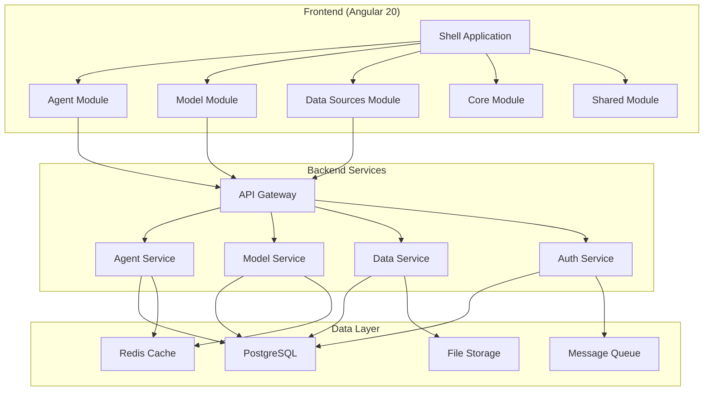
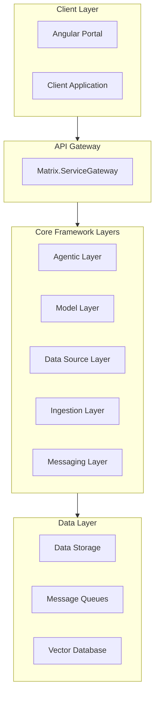

# # Architecture Overview

> Matrix Portal is built on modern Angular 20 architecture principles with enterprise-grade scalability, security, and maintainability.

## 🏗️ System Architecture

Matrix Portal follows a modular, microservices-inspired frontend architecture that ensures scalability, maintainability, and developer productivity.

### High-Level Architecture



### Angular 20 Modern Architecture

Matrix Portal leverages the latest Angular 20 features for optimal performance and developer experience:

#### Core Angular 20 Features
- **Standalone Components** - Simplified module architecture
- **Signal-based Reactivity** - Efficient change detection
- **Resource API** - Declarative data fetching
- **Modern Dependency Injection** - `inject()` function pattern
- **Control Flow Syntax** - `@if`, `@for`, `@switch` directives

#### Component Architecture Hierarchy

```typescript
// Base component providing common functionality
export abstract class BaseComponent<T = any> {
  protected notificationService = inject(NotificationService);
  protected route = inject(ActivatedRoute);
  protected router = inject(Router);
  
  // Common lifecycle and utility methods
  protected abstract getErrorContext(): string;
  protected showError(error: any): void { /* implementation */ }
  protected showSuccess(message: string): void { /* implementation */ }
}

// List component base for CRUD operations
export abstract class BaseListComponent<T> extends BaseComponent<T> {
  // List-specific functionality
  items = signal<T[]>([]);
  loading = signal(false);
  searchTerm = signal('');
  
  protected abstract loadItems(): Promise<T[]>;
  protected abstract deleteItem(item: T): Promise<void>;
}

// Detail component base for item management
export abstract class BaseDetailComponent<T> extends BaseComponent<T> {
  // Detail-specific functionality
  item = signal<T | null>(null);
  isEditing = signal(false);
  
  protected abstract loadItem(id: string): Promise<T>;
  protected abstract saveItem(item: T): Promise<T>;
}
```

## 🔧 Technical Stack

### Frontend Technology Stack

#### Core Framework
- **Angular 20** - Latest Angular framework with modern features
- **TypeScript 5.4+** - Type-safe development with latest language features
- **RxJS 7.8+** - Reactive programming for complex async operations
- **Angular Material 17+** - Material Design component library

#### Modern Patterns
- **Signals** - Fine-grained reactivity for state management
- **Resource API** - Declarative approach to data fetching
- **Standalone Components** - Simplified architecture without NgModules
- **Functional Guards & Resolvers** - Modern routing patterns

#### Development Tools
- **Angular CLI 17+** - Project scaffolding and build tools
- **ESLint + Prettier** - Code quality and formatting
- **Jest** - Unit testing framework
- **Cypress** - End-to-end testing
- **Storybook** - Component documentation and testing

### Backend Integration

#### API Architecture
- **RESTful APIs** - Standard HTTP methods and status codes
- **OpenAPI 3.0** - Comprehensive API documentation
- **JWT Authentication** - Secure token-based authentication
- **Rate Limiting** - Protection against abuse and overload

#### Data Management
- **HTTP Interceptors** - Centralized request/response handling
- **Error Handling** - Comprehensive error management strategy
- **Caching Strategy** - Multi-level caching for performance
- **Offline Support** - Progressive Web App capabilities

## 📁 Project Structure

### Directory Organization

```
src/
├── app/
│   ├── app.component.ts              # Root application component
│   ├── app.config.ts                 # Application configuration
│   ├── app.routes.ts                 # Main routing configuration
│   │
│   ├── core/                         # Core functionality (singleton services)
│   │   ├── guards/                   # Route guards
│   │   ├── interceptors/             # HTTP interceptors
│   │   ├── services/                 # Core application services
│   │   └── core.config.ts            # Core module configuration
│   │
│   ├── shared/                       # Shared components and utilities
│   │   ├── components/               # Reusable UI components
│   │   │   ├── base/                 # Base component classes
│   │   │   ├── ui/                   # Generic UI components
│   │   │   └── layout/               # Layout components
│   │   ├── pipes/                    # Custom pipes
│   │   ├── directives/               # Custom directives
│   │   ├── models/                   # Shared interfaces and types
│   │   └── utils/                    # Utility functions
│   │
│   ├── modules/                      # Feature modules
│   │   ├── agents/                   # Agent management module
│   │   │   ├── components/
│   │   │   ├── services/
│   │   │   ├── models/
│   │   │   └── agents.routes.ts
│   │   │
│   │   ├── models/                   # Model management module
│   │   │   ├── components/
│   │   │   ├── services/
│   │   │   ├── models/
│   │   │   └── models.routes.ts
│   │   │
│   │   ├── datasources/              # Data source management
│   │   │   ├── components/
│   │   │   ├── services/
│   │   │   ├── models/
│   │   │   └── datasources.routes.ts
│   │   │
│   │   └── collections/              # Collection management
│   │       ├── components/
│   │       ├── services/
│   │       ├── models/
│   │       └── collections.routes.ts
│   │
│   ├── layout/                       # Application layout components
│   │   ├── shell/                    # Main shell component
│   │   ├── header/                   # Application header
│   │   ├── footer/                   # Application footer
│   │   ├── breadcrumb/               # Breadcrumb navigation
│   │   └── notification-panel/       # Notification system
│   │
│   └── styles/                       # Global styles and themes
│       ├── theme.scss                # Material theme configuration
│       └── _variables.scss           # CSS custom properties
│
├── assets/                           # Static assets
│   ├── images/                       # Image files
│   ├── icons/                        # Icon files
│   └── i18n/                         # Internationalization files
│
├── environments/                     # Environment configurations
│   ├── environment.ts                # Development environment
│   ├── environment.prod.ts           # Production environment
│   └── environment.test.ts           # Testing environment
│
└── styles.css                       # Global application styles
```

### Module Architecture

#### Feature Module Pattern

```typescript
// agents.routes.ts - Modern standalone routing
export const AGENTS_ROUTES: Routes = [
  {
    path: '',
    loadComponent: () => import('./agent-list/agent-list.component')
      .then(m => m.AgentListComponent),
    title: 'Agents'
  },
  {
    path: 'new',
    loadComponent: () => import('./agent-detail/agent-detail.component')
      .then(m => m.AgentDetailComponent),
    title: 'New Agent'
  },
  {
    path: ':id',
    loadComponent: () => import('./agent-detail/agent-detail.component')
      .then(m => m.AgentDetailComponent),
    resolve: {
      agent: agentResolver
    },
    title: 'Agent Details'
  }
];

// agent.service.ts - Modern service with inject()
@Injectable({ providedIn: 'root' })
export class AgentService {
  private http = inject(HttpClient);
  private cache = inject(CacheService);
  private notification = inject(NotificationService);

  private baseUrl = '/api/agents';

  // Resource-based data fetching
  getAgents() {
    return resource({
      request: () => ({}),
      loader: () => this.http.get<Agent[]>(this.baseUrl)
    });
  }

  // Traditional promise-based methods for mutations
  async createAgent(agent: CreateAgentRequest): Promise<Agent> {
    try {
      const result = await firstValueFrom(
        this.http.post<Agent>(this.baseUrl, agent)
      );
      this.notification.showSuccess('Agent created successfully');
      return result;
    } catch (error) {
      this.notification.showError('Failed to create agent');
      throw error;
    }
  }
}
```

#### Service Layer Architecture

```typescript
// Core service hierarchy
export abstract class BaseService<T> {
  protected http = inject(HttpClient);
  protected notification = inject(NotificationService);
  protected cache = inject(CacheService);
  
  protected abstract baseUrl: string;
  
  protected handleError(error: any, context: string): never {
    this.notification.showError(`${context}: ${error.message}`);
    throw error;
  }
}

// Entity-specific service
@Injectable({ providedIn: 'root' })
export class AgentService extends BaseService<Agent> {
  protected baseUrl = '/api/agents';
  
  // Implementation specific to agents
}
```

## 🚀 Performance Architecture

### Optimization Strategies

#### Code Splitting & Lazy Loading
- **Feature-based code splitting** - Each module loads independently
- **Component-level lazy loading** - Large components load on demand
- **Dynamic imports** - Runtime module loading based on user actions

#### Change Detection Optimization
- **OnPush change detection** - Optimized change detection strategy
- **Signal-based updates** - Fine-grained reactivity
- **Immutable state patterns** - Prevent unnecessary re-renders

#### Caching Strategy
- **HTTP caching** - Browser and service worker caching
- **Application-level caching** - In-memory data caching
- **Progressive loading** - Load critical data first

### Performance Monitoring

```typescript
// Performance monitoring service
@Injectable({ providedIn: 'root' })
export class PerformanceService {
  private performanceObserver = inject(PerformanceObserver, { optional: true });
  
  trackComponentLoad(componentName: string): void {
    performance.mark(`${componentName}-start`);
  }
  
  trackComponentReady(componentName: string): void {
    performance.mark(`${componentName}-end`);
    performance.measure(
      `${componentName}-load`,
      `${componentName}-start`,
      `${componentName}-end`
    );
  }
}
```

## 🛡️ Security Architecture

### Security Layers

#### Authentication & Authorization
- **JWT Token Management** - Secure token handling and refresh
- **Route Guards** - Protected routes based on user permissions
- **Role-based Access Control** - Granular permission system
- **Session Management** - Secure session handling

#### Data Protection
- **Input Sanitization** - XSS prevention and data validation
- **HTTPS Enforcement** - Secure communication channels
- **Content Security Policy** - Protection against code injection
- **Audit Logging** - Comprehensive activity tracking

```typescript
// Security service implementation
@Injectable({ providedIn: 'root' })
export class SecurityService {
  private authService = inject(AuthService);
  
  canAccess(resource: string, action: string): boolean {
    const userPermissions = this.authService.getCurrentUserPermissions();
    return userPermissions.some(permission => 
      permission.resource === resource && 
      permission.actions.includes(action)
    );
  }
  
  sanitizeInput(input: string): string {
    // Implementation for input sanitization
    return input; // Simplified
  }
}
```

---

*Continue exploring the architecture with detailed [Component Documentation](components.md) or learn about [Data Flow Patterns](data-flow.md)*

The Matrix Agentic Platform is designed as a modular, layered architecture to support enterprise-grade AI agent management, orchestration, and integration. The architecture is built on .NET 8 and is composed of several core layers, each responsible for a specific set of functionalities.

## High-Level Architecture Diagram



## Layered Architecture

### 1. Client Layer
- **Portal Application**: Angular-based web UI for agent management, data source configuration, model registry, and monitoring.
- **Client Application**: .NET 8 client for programmatic access.

### 2. API Gateway Layer
- **Matrix.ServiceGateway**: Central entry point for all client-server communication, handling routing, authentication, rate limiting, and monitoring.

### 3. Agentic Layer
- **Agent Registry**: Manages agent registration, discovery, and lifecycle.
- **Base Agent**: Abstract base for all agent implementations.
- **Agent Builder**: Fluent builder for agent composition and configuration.

### 4. Model Layer
- **Model Registry**: Handles model registration, versioning, deployment, and monitoring.

### 5. Data Source Layer
- **Data Connectors**: Support for structured, semi-structured, unstructured, multimedia, streaming, and vector data sources.

### 6. Ingestion Layer
- **Chunking Service**: Document splitting, context preservation, metadata extraction.
- **Configuration Service**: Pipeline and processing rules.
- **Connectors**: Integration with Azure Search and custom sources.

### 7. Messaging Layer
- **Messaging Engine**: Message routing, event publication, transformation.
- **Azure Service Bus Connector**: Queue and topic management.

### 8. Data Layer
- **Data Storage**: Persistent storage for agent state, models, and metadata.
- **Message Queues**: Asynchronous communication between services.
- **Vector Database**: Storage for embeddings and vectorized data.

## Key Architectural Principles
- **Modularity**: Each layer is independently deployable and testable.
- **Extensibility**: New agents, models, and connectors can be added with minimal changes.
- **Security**: Built-in authentication, authorization, and audit logging.
- **Scalability**: Supports distributed deployment and horizontal scaling.
- **Observability**: Integrated monitoring, logging, and alerting.

For detailed documentation on each layer, see the subpages in this section.
