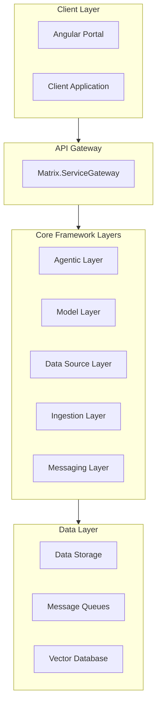

# Architecture Overview

The Matrix Agentic Platform is designed as a modular, layered architecture to support enterprise-grade AI agent management, orchestration, and integration. The architecture is built on .NET 8 and is composed of several core layers, each responsible for a specific set of functionalities.

## High-Level Architecture Diagram

## Layered Architecture

### 1. Client Layer
- **Portal Application**: Angular-based web UI for agent management, data source configuration, model registry, and monitoring.
- **Client Application**: .NET 8 client for programmatic access.

### 2. API Gateway Layer
- **Matrix.ServiceGateway**: Central entry point for all client-server communication, handling routing, authentication, rate limiting, and monitoring.

### 3. Agentic Layer
- **Agent Registry**: Manages agent registration, discovery, and lifecycle.
- **Base Agent**: Abstract base for all agent implementations.
- **Agent Builder**: Fluent builder for agent composition and configuration.

### 4. Model Layer
- **Model Registry**: Handles model registration, versioning, deployment, and monitoring.

### 5. Data Source Layer
- **Data Connectors**: Support for structured, semi-structured, unstructured, multimedia, streaming, and vector data sources.

### 6. Ingestion Layer
- **Chunking Service**: Document splitting, context preservation, metadata extraction.
- **Configuration Service**: Pipeline and processing rules.
- **Connectors**: Integration with Azure Search and custom sources.

### 7. Messaging Layer
- **Messaging Engine**: Message routing, event publication, transformation.
- **Azure Service Bus Connector**: Queue and topic management.

### 8. Data Layer
- **Data Storage**: Persistent storage for agent state, models, and metadata.
- **Message Queues**: Asynchronous communication between services.
- **Vector Database**: Storage for embeddings and vectorized data.

## Key Architectural Principles
- **Modularity**: Each layer is independently deployable and testable.
- **Extensibility**: New agents, models, and connectors can be added with minimal changes.
- **Security**: Built-in authentication, authorization, and audit logging.
- **Scalability**: Supports distributed deployment and horizontal scaling.
- **Observability**: Integrated monitoring, logging, and alerting.

For detailed documentation on each layer, see the subpages in this section.
