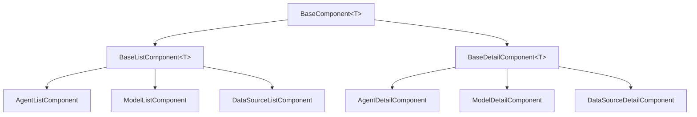

# # System Components

> Detailed documentation of Matrix Portal's component architecture, based on Angular 20 best practices and enterprise-grade patterns.

## 🏗️ Component Hierarchy

Matrix Portal implements a three-tier component inheritance system that ensures consistency, reusability, and maintainability across all features.

### Base Component Architecture



### Core Component Classes

#### 1. BaseComponent<T>

The foundation component providing common functionality across all components.

```typescript
export abstract class BaseComponent<T = any> implements OnInit, OnDestroy {
  // Modern Angular 20 dependency injection
  protected route = inject(ActivatedRoute);
  protected router = inject(Router);
  protected notificationService = inject(NotificationService);
  protected cdr = inject(ChangeDetectorRef);
  
  // Reactive state management with signals
  protected loading = signal(false);
  protected error = signal<string | null>(null);
  
  // Lifecycle management
  private destroy$ = new Subject<void>();
  
  ngOnInit(): void {
    this.initializeComponent();
  }
  
  ngOnDestroy(): void {
    this.destroy$.next();
    this.destroy$.complete();
  }
  
  // Abstract methods for derived classes
  protected abstract initializeComponent(): void;
  protected abstract getErrorContext(): string;
  
  // Common utility methods
  protected showError(error: any): void {
    const context = this.getErrorContext();
    this.notificationService.showError(`${context}: ${error.message || error}`);
    this.error.set(error.message || 'An unexpected error occurred');
  }
  
  protected showSuccess(message: string): void {
    this.notificationService.showSuccess(message);
  }
  
  protected setLoading(loading: boolean): void {
    this.loading.set(loading);
  }
  
  protected navigateWithState(path: string[], state?: any): void {
    this.router.navigate(path, { state });
  }
  
  // Subscription management helper
  protected takeUntilDestroyed() {
    return takeUntil(this.destroy$);
  }
}
```

#### 2. BaseListComponent<T>

Specialized component for managing collections of entities with CRUD operations.

```typescript
export abstract class BaseListComponent<T> extends BaseComponent<T> {
  // Service injection
  protected abstract service: any;
  
  // Reactive state with signals
  items = signal<T[]>([]);
  filteredItems = computed(() => {
    const items = this.items();
    const searchTerm = this.searchTerm().toLowerCase();
    
    if (!searchTerm) return items;
    
    return items.filter(item => 
      this.searchableFields().some(field => 
        this.getNestedProperty(item, field)?.toLowerCase().includes(searchTerm)
      )
    );
  });
  
  // Search and filtering
  searchTerm = signal('');
  searchableFields = signal<string[]>([]);
  
  // Pagination
  currentPage = signal(0);
  pageSize = signal(20);
  totalItems = signal(0);
  
  // Selection state
  selectedItems = signal<Set<T>>(new Set());
  isAllSelected = computed(() => {
    const items = this.filteredItems();
    const selected = this.selectedItems();
    return items.length > 0 && items.every(item => selected.has(item));
  });
  
  protected initializeComponent(): void {
    this.loadItems();
  }
  
  // Abstract methods
  protected abstract loadItems(): Promise<void>;
  protected abstract deleteItem(item: T): Promise<void>;
  protected abstract getItemId(item: T): string | number;
  protected abstract getDisplayColumns(): string[];
  
  // Common list operations
  async refreshItems(): Promise<void> {
    this.setLoading(true);
    try {
      await this.loadItems();
    } catch (error) {
      this.showError(error);
    } finally {
      this.setLoading(false);
    }
  }
  
  onSearch(term: string): void {
    this.searchTerm.set(term);
    this.currentPage.set(0); // Reset to first page
  }
  
  onPageChange(page: number): void {
    this.currentPage.set(page);
  }
  
  toggleItemSelection(item: T): void {
    const selected = new Set(this.selectedItems());
    if (selected.has(item)) {
      selected.delete(item);
    } else {
      selected.add(item);
    }
    this.selectedItems.set(selected);
  }
  
  toggleSelectAll(): void {
    const items = this.filteredItems();
    const selected = this.selectedItems();
    
    if (this.isAllSelected()) {
      // Deselect all
      const newSelected = new Set(selected);
      items.forEach(item => newSelected.delete(item));
      this.selectedItems.set(newSelected);
    } else {
      // Select all
      const newSelected = new Set([...selected, ...items]);
      this.selectedItems.set(newSelected);
    }
  }
  
  async deleteSelected(): Promise<void> {
    const selected = Array.from(this.selectedItems());
    if (selected.length === 0) return;
    
    const confirmed = await this.confirmBulkDelete(selected.length);
    if (!confirmed) return;
    
    this.setLoading(true);
    try {
      await Promise.all(selected.map(item => this.deleteItem(item)));
      this.selectedItems.set(new Set());
      await this.loadItems();
      this.showSuccess(`Deleted ${selected.length} items successfully`);
    } catch (error) {
      this.showError(error);
    } finally {
      this.setLoading(false);
    }
  }
  
  onEdit(item: T): void {
    const id = this.getItemId(item);
    this.navigateWithState([id.toString()], { item });
  }
  
  onView(item: T): void {
    const id = this.getItemId(item);
    this.navigateWithState([id.toString()], { item, mode: 'view' });
  }
  
  onCreate(): void {
    this.navigateWithState(['new']);
  }
  
  // Utility methods
  private getNestedProperty(obj: any, path: string): any {
    return path.split('.').reduce((o, p) => o?.[p], obj);
  }
  
  private async confirmBulkDelete(count: number): Promise<boolean> {
    // Implementation would show confirmation dialog
    return confirm(`Are you sure you want to delete ${count} items?`);
  }
}
```

#### 3. BaseDetailComponent<T>

Specialized component for managing individual entity details with form handling.

```typescript
export abstract class BaseDetailComponent<T> extends BaseComponent<T> 
  implements AfterViewInit {
  
  // Form management
  protected fb = inject(FormBuilder);
  itemForm!: FormGroup;
  
  // Component state
  item = signal<T | null>(null);
  originalItem = signal<T | null>(null);
  isEditing = signal(false);
  isNew = signal(false);
  isDirty = computed(() => {
    const current = this.item();
    const original = this.originalItem();
    return JSON.stringify(current) !== JSON.stringify(original);
  });
  
  // Navigation state
  activeSection = signal('general');
  sections = signal<string[]>(['general']);
  
  // Service injection
  protected abstract service: any;
  
  ngAfterViewInit(): void {
    this.setupFormValidation();
  }
  
  protected initializeComponent(): void {
    this.setupRouting();
    this.initializeForm();
  }
  
  // Abstract methods
  protected abstract createForm(): FormGroup;
  protected abstract populateForm(item: T): void;
  protected abstract getFormValue(): Partial<T>;
  protected abstract validateForm(): boolean;
  protected abstract getSections(): string[];
  
  private setupRouting(): void {
    const id = this.route.snapshot.paramMap.get('id');
    this.isNew.set(id === 'new');
    
    if (this.isNew()) {
      this.isEditing.set(true);
      this.initializeNewItem();
    } else if (id) {
      this.loadItem(id);
    }
    
    // Handle navigation state
    const navigationState = history.state;
    if (navigationState?.item) {
      this.setItem(navigationState.item);
      if (navigationState.mode === 'view') {
        this.isEditing.set(false);
      }
    }
  }
  
  private initializeForm(): void {
    this.itemForm = this.createForm();
    this.sections.set(this.getSections());
  }
  
  private setupFormValidation(): void {
    this.itemForm.valueChanges
      .pipe(this.takeUntilDestroyed())
      .subscribe(value => {
        if (this.isEditing()) {
          this.updateItemFromForm();
        }
      });
  }
  
  async loadItem(id: string): Promise<void> {
    this.setLoading(true);
    try {
      const item = await this.service.getById(id);
      this.setItem(item);
    } catch (error) {
      this.showError(error);
    } finally {
      this.setLoading(false);
    }
  }
  
  private setItem(item: T): void {
    this.item.set(item);
    this.originalItem.set(structuredClone(item));
    this.populateForm(item);
  }
  
  private initializeNewItem(): void {
    const newItem = this.createNewItem();
    this.item.set(newItem);
    this.originalItem.set(structuredClone(newItem));
  }
  
  private updateItemFromForm(): void {
    if (this.itemForm.valid) {
      const formValue = this.getFormValue();
      const currentItem = this.item();
      if (currentItem) {
        this.item.set({ ...currentItem, ...formValue });
      }
    }
  }
  
  // Action methods
  onEdit(): void {
    this.isEditing.set(true);
  }
  
  onCancel(): void {
    if (this.isNew()) {
      this.navigateBack();
    } else {
      this.isEditing.set(false);
      const original = this.originalItem();
      if (original) {
        this.setItem(original);
      }
    }
  }
  
  async onSave(): Promise<void> {
    if (!this.validateForm()) {
      this.showError('Please fix form errors before saving');
      return;
    }
    
    this.setLoading(true);
    try {
      const item = this.item();
      if (!item) return;
      
      let savedItem: T;
      if (this.isNew()) {
        savedItem = await this.service.create(item);
        this.showSuccess('Item created successfully');
        // Navigate to edit mode with the new ID
        const id = this.getItemId(savedItem);
        this.router.navigate(['..', id.toString()], { 
          relativeTo: this.route,
          state: { item: savedItem }
        });
      } else {
        savedItem = await this.service.update(item);
        this.showSuccess('Item updated successfully');
        this.setItem(savedItem);
      }
      
      this.isEditing.set(false);
    } catch (error) {
      this.showError(error);
    } finally {
      this.setLoading(false);
    }
  }
  
  async onDelete(): Promise<void> {
    const item = this.item();
    if (!item || this.isNew()) return;
    
    const confirmed = await this.confirmDelete();
    if (!confirmed) return;
    
    this.setLoading(true);
    try {
      await this.service.delete(item);
      this.showSuccess('Item deleted successfully');
      this.navigateBack();
    } catch (error) {
      this.showError(error);
    } finally {
      this.setLoading(false);
    }
  }
  
  onSectionChange(section: string): void {
    this.activeSection.set(section);
  }
  
  // Navigation methods
  private navigateBack(): void {
    this.router.navigate(['..'], { relativeTo: this.route });
  }
  
  // Utility methods
  protected abstract createNewItem(): T;
  protected abstract getItemId(item: T): string | number;
  
  private async confirmDelete(): Promise<boolean> {
    // Implementation would show confirmation dialog
    return confirm('Are you sure you want to delete this item?');
  }
  
  protected getErrorContext(): string {
    return `${this.constructor.name}`;
  }
}
```

## 🧩 Feature Components

### Agent Management Components

#### AgentListComponent

```typescript
@Component({
  selector: 'app-agent-list',
  standalone: true,
  imports: [CommonModule, MaterialModule, SharedModule],
  templateUrl: './agent-list.component.html',
  styleUrls: ['./agent-list.component.css']
})
export class AgentListComponent extends BaseListComponent<Agent> {
  protected service = inject(AgentService);
  
  constructor() {
    super();
    this.searchableFields.set(['name', 'description', 'status']);
  }
  
  protected async loadItems(): Promise<void> {
    const agents = await this.service.getAll();
    this.items.set(agents);
    this.totalItems.set(agents.length);
  }
  
  protected async deleteItem(agent: Agent): Promise<void> {
    await this.service.delete(agent.id);
  }
  
  protected getItemId(agent: Agent): string {
    return agent.id;
  }
  
  protected getDisplayColumns(): string[] {
    return ['name', 'status', 'lastModified', 'actions'];
  }
  
  protected getErrorContext(): string {
    return 'Agent List';
  }
}
```

#### AgentDetailComponent

```typescript
@Component({
  selector: 'app-agent-detail',
  standalone: true,
  imports: [CommonModule, MaterialModule, ReactiveFormsModule, SharedModule],
  templateUrl: './agent-detail.component.html',
  styleUrls: ['./agent-detail.component.css']
})
export class AgentDetailComponent extends BaseDetailComponent<Agent> {
  protected service = inject(AgentService);
  private modelService = inject(ModelService);
  
  // Agent-specific state
  availableModels = signal<Model[]>([]);
  agentCapabilities = signal<string[]>([]);
  
  protected async initializeComponent(): Promise<void> {
    await super.initializeComponent();
    await this.loadDependencies();
  }
  
  private async loadDependencies(): Promise<void> {
    try {
      const [models, capabilities] = await Promise.all([
        this.modelService.getAll(),
        this.service.getCapabilities()
      ]);
      this.availableModels.set(models);
      this.agentCapabilities.set(capabilities);
    } catch (error) {
      this.showError(error);
    }
  }
  
  protected createForm(): FormGroup {
    return this.fb.group({
      name: ['', [Validators.required, Validators.minLength(3)]],
      description: [''],
      modelId: ['', Validators.required],
      capabilities: this.fb.array([]),
      parameters: this.fb.group({
        temperature: [0.7, [Validators.min(0), Validators.max(2)]],
        maxTokens: [1000, [Validators.min(1), Validators.max(4096)]],
        timeoutMs: [30000, [Validators.min(1000), Validators.max(300000)]]
      }),
      constraints: this.fb.group({
        maxConcurrency: [10, [Validators.min(1), Validators.max(100)]],
        rateLimit: [100, [Validators.min(1), Validators.max(1000)]],
        allowedDomains: this.fb.array([])
      })
    });
  }
  
  protected populateForm(agent: Agent): void {
    this.itemForm.patchValue({
      name: agent.name,
      description: agent.description,
      modelId: agent.modelId,
      parameters: agent.parameters,
      constraints: agent.constraints
    });
    
    // Populate capabilities array
    const capabilitiesArray = this.itemForm.get('capabilities') as FormArray;
    capabilitiesArray.clear();
    agent.capabilities.forEach(capability => {
      capabilitiesArray.push(this.fb.control(capability));
    });
  }
  
  protected getFormValue(): Partial<Agent> {
    const formValue = this.itemForm.value;
    return {
      name: formValue.name,
      description: formValue.description,
      modelId: formValue.modelId,
      capabilities: formValue.capabilities,
      parameters: formValue.parameters,
      constraints: formValue.constraints
    };
  }
  
  protected validateForm(): boolean {
    if (this.itemForm.invalid) {
      this.markFormGroupTouched(this.itemForm);
      return false;
    }
    return true;
  }
  
  protected getSections(): string[] {
    return ['general', 'configuration', 'capabilities', 'constraints', 'audit'];
  }
  
  protected createNewItem(): Agent {
    return {
      id: '',
      name: '',
      description: '',
      modelId: '',
      capabilities: [],
      parameters: {
        temperature: 0.7,
        maxTokens: 1000,
        timeoutMs: 30000
      },
      constraints: {
        maxConcurrency: 10,
        rateLimit: 100,
        allowedDomains: []
      },
      status: 'draft',
      createdAt: new Date(),
      updatedAt: new Date(),
      createdBy: '',
      updatedBy: ''
    };
  }
  
  protected getItemId(agent: Agent): string {
    return agent.id;
  }
  
  protected getErrorContext(): string {
    return 'Agent Detail';
  }
  
  // Agent-specific methods
  onAddCapability(capability: string): void {
    const capabilitiesArray = this.itemForm.get('capabilities') as FormArray;
    capabilitiesArray.push(this.fb.control(capability));
  }
  
  onRemoveCapability(index: number): void {
    const capabilitiesArray = this.itemForm.get('capabilities') as FormArray;
    capabilitiesArray.removeAt(index);
  }
  
  private markFormGroupTouched(formGroup: FormGroup): void {
    Object.keys(formGroup.controls).forEach(key => {
      const control = formGroup.get(key);
      control?.markAsTouched();
      
      if (control instanceof FormGroup) {
        this.markFormGroupTouched(control);
      }
    });
  }
}
```

## 🎨 UI Component Library

### Shared Components

#### Card Component

```typescript
@Component({
  selector: 'app-card',
  standalone: true,
  imports: [CommonModule],
  template: `
    <div class="card" [class.hoverable]="hoverable" (click)="onClick()">
      <div class="card-header" *ngIf="hasHeader">
        <ng-content select="[slot=header]"></ng-content>
      </div>
      <div class="card-content">
        <ng-content></ng-content>
      </div>
      <div class="card-actions" *ngIf="hasActions">
        <ng-content select="[slot=actions]"></ng-content>
      </div>
    </div>
  `,
  styleUrls: ['./card.component.css']
})
export class CardComponent {
  @Input() hoverable = false;
  @Output() cardClick = new EventEmitter<void>();
  
  hasHeader = false;
  hasActions = false;
  
  ngAfterContentInit(): void {
    // Check for projected content
    this.hasHeader = this.hasProjectedContent('[slot=header]');
    this.hasActions = this.hasProjectedContent('[slot=actions]');
  }
  
  onClick(): void {
    if (this.hoverable) {
      this.cardClick.emit();
    }
  }
  
  private hasProjectedContent(selector: string): boolean {
    // Implementation to check for projected content
    return true; // Simplified
  }
}
```

#### Loading Component

```typescript
@Component({
  selector: 'app-loading',
  standalone: true,
  imports: [CommonModule, MatProgressSpinnerModule],
  template: `
    <div class="loading-container" [class.overlay]="overlay">
      <mat-spinner [diameter]="size" [color]="color"></mat-spinner>
      <p *ngIf="message" class="loading-message">{{ message }}</p>
    </div>
  `,
  styleUrls: ['./loading.component.css']
})
export class LoadingComponent {
  @Input() overlay = false;
  @Input() size = 50;
  @Input() color: 'primary' | 'accent' | 'warn' = 'primary';
  @Input() message = '';
}
```

## 📱 Layout Components

### Shell Component

```typescript
@Component({
  selector: 'app-shell',
  standalone: true,
  imports: [CommonModule, RouterOutlet, HeaderComponent, FooterComponent, BreadcrumbComponent],
  template: `
    <div class="app-shell">
      <app-header></app-header>
      <app-breadcrumb></app-breadcrumb>
      <main class="main-content">
        <router-outlet></router-outlet>
      </main>
      <app-footer></app-footer>
    </div>
  `,
  styleUrls: ['./shell.component.css']
})
export class ShellComponent implements OnInit {
  private themeService = inject(ThemeService);
  private authService = inject(AuthService);
  
  ngOnInit(): void {
    this.initializeTheme();
    this.checkAuthentication();
  }
  
  private initializeTheme(): void {
    this.themeService.initializeTheme();
  }
  
  private checkAuthentication(): void {
    // Handle authentication state
  }
}
```

---

*Next: Explore [Data Flow Patterns](data-flow.md) to understand how data moves through the system, or dive into [Security Architecture](security.md) for security implementation details.*

The Matrix Agentic Platform is composed of several core components, each mapped to a specific architectural layer:

## Agentic Layer
- **Agent Registry**: Manages agent registration, discovery, and lifecycle.
- **Base Agent**: Abstract base for all agent implementations.
- **Agent Builder**: Fluent builder for agent composition and configuration.

## Model Layer
- **Model Registry**: Handles model registration, versioning, deployment, and monitoring.

## Data Source Layer
- **Data Connectors**: Support for structured, semi-structured, unstructured, multimedia, streaming, and vector data sources.

## Ingestion Layer
- **Chunking Service**: Document splitting, context preservation, metadata extraction.
- **Configuration Service**: Pipeline and processing rules.
- **Connectors**: Integration with Azure Search and custom sources.

## Messaging Layer
- **Messaging Engine**: Message routing, event publication, transformation.
- **Azure Service Bus Connector**: Queue and topic management.

## Data Layer
- **Data Storage**: Persistent storage for agent state, models, and metadata.
- **Message Queues**: Asynchronous communication between services.
- **Vector Database**: Storage for embeddings and vectorized data.
