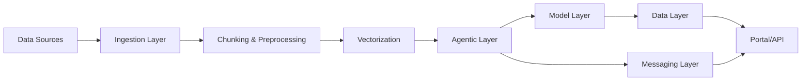

# Data Flow

The data flow in the Matrix Agentic Platform is designed for flexibility, scalability, and traceability. Below is a typical flow of data through the platform:

1. **Ingestion**: Data is ingested from various sources (databases, APIs, files, streams) via connectors.
2. **Chunking & Preprocessing**: The Ingestion Layer splits documents, preserves context, and extracts metadata.
3. **Vectorization**: Data can be transformed into vector representations for advanced search and retrieval.
4. **Agent Processing**: Agents process the data, perform reasoning, decision-making, or trigger workflows.
5. **Model Inference**: If required, data is passed to registered models for inference or transformation.
6. **Storage & Messaging**: Results and state are persisted in the Data Layer or sent to other services via the Messaging Layer.
7. **Portal & API Access**: Processed data and results are made available to users and external systems via the Portal and API Gateway.

This flow ensures that data is efficiently processed, transformed, and made available for intelligent agentic operations and user interaction.
