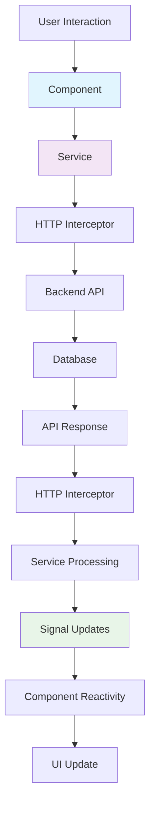
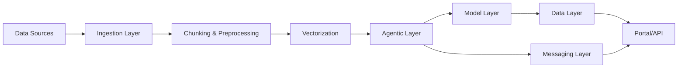

# # Data Flow & Processing

> Understanding how data flows through Matrix Portal's Angular 20 architecture, from user interactions to backend services and back to the UI.

## 🌊 Data Flow Architecture

Matrix Portal implements a modern data flow architecture using Angular 20's Resource API, Signals, and traditional RxJS patterns for optimal performance and developer experience.

### Overall Data Flow



## 📡 Modern Data Fetching Patterns

### Resource API Implementation

Angular 20's Resource API provides declarative data fetching with built-in loading states and error handling.

```typescript
// Agent service with Resource API
@Injectable({ providedIn: 'root' })
export class AgentService {
  private http = inject(HttpClient);
  private baseUrl = '/api/agents';
  
  // Resource-based data fetching for list operations
  getAgentsResource() {
    return resource({
      request: () => ({}),
      loader: ({ request }) => {
        return this.http.get<Agent[]>(this.baseUrl).pipe(
          map(agents => ({
            agents,
            total: agents.length,
            timestamp: Date.now()
          }))
        );
      }
    });
  }
  
  // Resource with parameters for filtered data
  getAgentsByStatusResource(status: Signal<string>) {
    return resource({
      request: () => ({ status: status() }),
      loader: ({ request }) => {
        const params = new HttpParams().set('status', request.status);
        return this.http.get<Agent[]>(this.baseUrl, { params });
      }
    });
  }
  
  // Resource for individual agent
  getAgentResource(id: Signal<string>) {
    return resource({
      request: () => ({ id: id() }),
      loader: ({ request }) => {
        if (!request.id) {
          throw new Error('Agent ID is required');
        }
        return this.http.get<Agent>(`${this.baseUrl}/${request.id}`);
      }
    });
  }
}
```

### Component Resource Usage

```typescript
@Component({
  selector: 'app-agent-list',
  template: `
    <div class="agent-list">
      @if (agentsResource.isLoading()) {
        <app-loading message="Loading agents..."></app-loading>
      }
      
      @if (agentsResource.error()) {
        <app-error [error]="agentsResource.error()"></app-error>
      }
      
      @if (agentsResource.value(); as data) {
        <div class="agents-grid">
          @for (agent of data.agents; track agent.id) {
            <app-agent-card 
              [agent]="agent"
              (edit)="onEdit(agent)"
              (delete)="onDelete(agent)">
            </app-agent-card>
          }
        </div>
        
        <app-pagination 
          [total]="data.total"
          [pageSize]="pageSize()"
          [currentPage]="currentPage()"
          (pageChange)="onPageChange($event)">
        </app-pagination>
      }
    </div>
  `
})
export class AgentListComponent {
  private agentService = inject(AgentService);
  
  // Signal-based state
  statusFilter = signal('all');
  currentPage = signal(0);
  pageSize = signal(20);
  
  // Resource that reacts to filter changes
  agentsResource = this.agentService.getAgentsByStatusResource(this.statusFilter);
  
  onStatusChange(status: string): void {
    this.statusFilter.set(status);
    this.currentPage.set(0); // Reset pagination
    // Resource automatically refetches when statusFilter changes
  }
  
  onPageChange(page: number): void {
    this.currentPage.set(page);
  }
  
  onEdit(agent: Agent): void {
    // Navigation with state preservation
    this.router.navigate(['/agents', agent.id], {
      state: { returnUrl: this.router.url }
    });
  }
  
  async onDelete(agent: Agent): Promise<void> {
    try {
      await this.agentService.delete(agent.id);
      // Trigger resource reload
      this.agentsResource.reload();
      this.notificationService.showSuccess('Agent deleted successfully');
    } catch (error) {
      this.notificationService.showError('Failed to delete agent');
    }
  }
}
```

## 🔄 State Management Patterns

### Signal-Based State Management

```typescript
// Global application state service
@Injectable({ providedIn: 'root' })
export class AppStateService {
  // User context
  private _currentUser = signal<User | null>(null);
  private _userPermissions = signal<Permission[]>([]);
  
  // Application state
  private _isOffline = signal(false);
  private _notifications = signal<Notification[]>([]);
  private _theme = signal<'light' | 'dark'>('light');
  
  // Computed values
  readonly currentUser = this._currentUser.asReadonly();
  readonly userPermissions = this._userPermissions.asReadonly();
  readonly isOffline = this._isOffline.asReadonly();
  readonly notifications = this._notifications.asReadonly();
  readonly theme = this._theme.asReadonly();
  
  readonly unreadNotificationCount = computed(() => 
    this.notifications().filter(n => !n.read).length
  );
  
  readonly canManageAgents = computed(() =>
    this.userPermissions().some(p => p.resource === 'agents' && p.actions.includes('manage'))
  );
  
  // State mutations
  setCurrentUser(user: User | null): void {
    this._currentUser.set(user);
  }
  
  setUserPermissions(permissions: Permission[]): void {
    this._userPermissions.set(permissions);
  }
  
  addNotification(notification: Notification): void {
    this._notifications.update(notifications => [...notifications, notification]);
  }
  
  markNotificationAsRead(id: string): void {
    this._notifications.update(notifications =>
      notifications.map(n => n.id === id ? { ...n, read: true } : n)
    );
  }
  
  toggleTheme(): void {
    this._theme.update(current => current === 'light' ? 'dark' : 'light');
  }
  
  setOfflineStatus(isOffline: boolean): void {
    this._isOffline.set(isOffline);
  }
}
```

### Component State Integration

```typescript
@Component({
  selector: 'app-header',
  template: `
    <mat-toolbar color="primary">
      <span>Matrix Portal</span>
      
      <div class="header-actions">
        <!-- Theme toggle -->
        <button mat-icon-button (click)="toggleTheme()">
          <mat-icon>{{ themeIcon() }}</mat-icon>
        </button>
        
        <!-- Notifications -->
        <button mat-icon-button [matBadge]="unreadCount()" 
                [matBadgeHidden]="unreadCount() === 0">
          <mat-icon>notifications</mat-icon>
        </button>
        
        <!-- User menu -->
        <button mat-button [matMenuTriggerFor]="userMenu">
          {{ currentUser()?.name || 'User' }}
          <mat-icon>arrow_drop_down</mat-icon>
        </button>
      </div>
    </mat-toolbar>
    
    <mat-menu #userMenu="matMenu">
      <button mat-menu-item (click)="onProfile()">Profile</button>
      <button mat-menu-item (click)="onSettings()">Settings</button>
      <mat-divider></mat-divider>
      <button mat-menu-item (click)="onLogout()">Logout</button>
    </mat-menu>
  `
})
export class HeaderComponent {
  private appState = inject(AppStateService);
  private authService = inject(AuthService);
  
  // Reactive state from global store
  currentUser = this.appState.currentUser;
  unreadCount = this.appState.unreadNotificationCount;
  theme = this.appState.theme;
  
  // Computed UI state
  themeIcon = computed(() => 
    this.theme() === 'light' ? 'dark_mode' : 'light_mode'
  );
  
  toggleTheme(): void {
    this.appState.toggleTheme();
  }
  
  onProfile(): void {
    this.router.navigate(['/profile']);
  }
  
  onSettings(): void {
    this.router.navigate(['/settings']);
  }
  
  async onLogout(): Promise<void> {
    await this.authService.logout();
    this.router.navigate(['/login']);
  }
}
```

## 🔌 HTTP Interceptors & Middleware

### Authentication Interceptor

```typescript
export const authInterceptor: HttpInterceptorFn = (req, next) => {
  const authService = inject(AuthService);
  const token = authService.getAccessToken();
  
  if (token && !req.url.includes('/auth/')) {
    const authReq = req.clone({
      setHeaders: {
        Authorization: `Bearer ${token}`
      }
    });
    return next(authReq);
  }
  
  return next(req);
};
```

### Loading Interceptor

```typescript
export const loadingInterceptor: HttpInterceptorFn = (req, next) => {
  const loadingService = inject(LoadingService);
  
  // Skip loading for background requests
  if (req.headers.has('X-Skip-Loading')) {
    return next(req);
  }
  
  loadingService.show();
  
  return next(req).pipe(
    finalize(() => loadingService.hide())
  );
};
```

### Error Handling Interceptor

```typescript
export const errorInterceptor: HttpInterceptorFn = (req, next) => {
  const notificationService = inject(NotificationService);
  const router = inject(Router);
  
  return next(req).pipe(
    catchError((error: HttpErrorResponse) => {
      let errorMessage = 'An unexpected error occurred';
      
      switch (error.status) {
        case 400:
          errorMessage = 'Bad request. Please check your input.';
          break;
        case 401:
          errorMessage = 'Authentication required. Please log in.';
          router.navigate(['/login']);
          break;
        case 403:
          errorMessage = 'Access denied. You do not have permission.';
          break;
        case 404:
          errorMessage = 'The requested resource was not found.';
          break;
        case 409:
          errorMessage = 'Conflict. The resource already exists or conflicts with another resource.';
          break;
        case 500:
          errorMessage = 'Server error. Please try again later.';
          break;
        default:
          if (error.error?.message) {
            errorMessage = error.error.message;
          }
      }
      
      // Show error notification (skip for certain status codes)
      if (![401].includes(error.status)) {
        notificationService.showError(errorMessage);
      }
      
      return throwError(() => error);
    })
  );
};
```

### Cache Interceptor

```typescript
export const cacheInterceptor: HttpInterceptorFn = (req, next) => {
  const cacheService = inject(CacheService);
  
  // Only cache GET requests
  if (req.method !== 'GET') {
    return next(req);
  }
  
  // Skip caching for certain URLs
  if (req.url.includes('/auth/') || req.headers.has('X-Skip-Cache')) {
    return next(req);
  }
  
  // Check cache first
  const cachedResponse = cacheService.get(req.url);
  if (cachedResponse) {
    return of(cachedResponse);
  }
  
  return next(req).pipe(
    tap(response => {
      if (response instanceof HttpResponse) {
        cacheService.set(req.url, response);
      }
    })
  );
};
```

## 📊 Real-time Data Integration

### WebSocket Service

```typescript
@Injectable({ providedIn: 'root' })
export class WebSocketService {
  private socket: WebSocket | null = null;
  private reconnectAttempts = 0;
  private maxReconnectAttempts = 5;
  private reconnectInterval = 5000;
  
  // Subject for incoming messages
  private messageSubject = new Subject<any>();
  public messages$ = this.messageSubject.asObservable();
  
  // Connection state
  private _connectionState = signal<'connecting' | 'connected' | 'disconnected'>('disconnected');
  public connectionState = this._connectionState.asReadonly();
  
  connect(url: string): void {
    if (this.socket?.readyState === WebSocket.OPEN) {
      return; // Already connected
    }
    
    this._connectionState.set('connecting');
    this.socket = new WebSocket(url);
    
    this.socket.onopen = () => {
      this._connectionState.set('connected');
      this.reconnectAttempts = 0;
      console.log('WebSocket connected');
    };
    
    this.socket.onmessage = (event) => {
      try {
        const data = JSON.parse(event.data);
        this.messageSubject.next(data);
      } catch (error) {
        console.error('Error parsing WebSocket message:', error);
      }
    };
    
    this.socket.onclose = () => {
      this._connectionState.set('disconnected');
      this.handleReconnect();
    };
    
    this.socket.onerror = (error) => {
      console.error('WebSocket error:', error);
    };
  }
  
  private handleReconnect(): void {
    if (this.reconnectAttempts < this.maxReconnectAttempts) {
      this.reconnectAttempts++;
      setTimeout(() => {
        this.connect(this.socket?.url || '');
      }, this.reconnectInterval);
    }
  }
  
  send(data: any): void {
    if (this.socket?.readyState === WebSocket.OPEN) {
      this.socket.send(JSON.stringify(data));
    } else {
      console.warn('WebSocket is not connected');
    }
  }
  
  disconnect(): void {
    if (this.socket) {
      this.socket.close();
      this.socket = null;
    }
  }
}
```

### Real-time Agent Status Updates

```typescript
@Injectable({ providedIn: 'root' })
export class AgentStatusService {
  private webSocketService = inject(WebSocketService);
  
  // Agent status signals
  private _agentStatuses = signal<Map<string, AgentStatus>>(new Map());
  public agentStatuses = this._agentStatuses.asReadonly();
  
  constructor() {
    this.initializeWebSocket();
  }
  
  private initializeWebSocket(): void {
    this.webSocketService.connect('ws://localhost:3000/agents/status');
    
    this.webSocketService.messages$.subscribe(message => {
      if (message.type === 'agent_status_update') {
        this.updateAgentStatus(message.agentId, message.status);
      }
    });
  }
  
  private updateAgentStatus(agentId: string, status: AgentStatus): void {
    this._agentStatuses.update(statuses => {
      const newMap = new Map(statuses);
      newMap.set(agentId, status);
      return newMap;
    });
  }
  
  getAgentStatus(agentId: string): Signal<AgentStatus | undefined> {
    return computed(() => this.agentStatuses().get(agentId));
  }
  
  subscribeToAgent(agentId: string): void {
    this.webSocketService.send({
      type: 'subscribe',
      agentId
    });
  }
  
  unsubscribeFromAgent(agentId: string): void {
    this.webSocketService.send({
      type: 'unsubscribe',
      agentId
    });
  }
}
```

## 💾 Offline Data Handling

### Offline Service

```typescript
@Injectable({ providedIn: 'root' })
export class OfflineService {
  private appState = inject(AppStateService);
  
  // Offline state
  private _isOnline = signal(navigator.onLine);
  public isOnline = this._isOnline.asReadonly();
  
  // Pending operations queue
  private pendingOperations = signal<PendingOperation[]>([]);
  
  constructor() {
    this.setupOnlineDetection();
    this.processQueueWhenOnline();
  }
  
  private setupOnlineDetection(): void {
    window.addEventListener('online', () => {
      this._isOnline.set(true);
      this.appState.setOfflineStatus(false);
    });
    
    window.addEventListener('offline', () => {
      this._isOnline.set(false);
      this.appState.setOfflineStatus(true);
    });
  }
  
  private processQueueWhenOnline(): void {
    effect(() => {
      if (this.isOnline() && this.pendingOperations().length > 0) {
        this.processPendingOperations();
      }
    });
  }
  
  queueOperation(operation: PendingOperation): void {
    this.pendingOperations.update(ops => [...ops, operation]);
  }
  
  private async processPendingOperations(): Promise<void> {
    const operations = this.pendingOperations();
    this.pendingOperations.set([]); // Clear queue
    
    for (const operation of operations) {
      try {
        await this.executeOperation(operation);
      } catch (error) {
        // Re-queue failed operations
        this.pendingOperations.update(ops => [...ops, operation]);
      }
    }
  }
  
  private async executeOperation(operation: PendingOperation): Promise<void> {
    // Execute the queued operation
    // Implementation depends on operation type
  }
}
```

## 📈 Performance Optimization

### Data Flow Optimization Strategies

#### 1. Memoization and Caching

```typescript
@Injectable({ providedIn: 'root' })
export class CacheService {
  private cache = new Map<string, CacheEntry>();
  private readonly defaultTTL = 5 * 60 * 1000; // 5 minutes
  
  get<T>(key: string): T | null {
    const entry = this.cache.get(key);
    
    if (!entry) {
      return null;
    }
    
    if (Date.now() > entry.expiry) {
      this.cache.delete(key);
      return null;
    }
    
    return entry.data as T;
  }
  
  set<T>(key: string, data: T, ttl: number = this.defaultTTL): void {
    const entry: CacheEntry = {
      data,
      expiry: Date.now() + ttl
    };
    this.cache.set(key, entry);
  }
  
  invalidate(pattern?: string): void {
    if (!pattern) {
      this.cache.clear();
      return;
    }
    
    const keysToDelete = Array.from(this.cache.keys())
      .filter(key => key.includes(pattern));
    
    keysToDelete.forEach(key => this.cache.delete(key));
  }
}
```

#### 2. Optimistic Updates

```typescript
@Injectable({ providedIn: 'root' })
export class OptimisticUpdateService {
  private http = inject(HttpClient);
  private notificationService = inject(NotificationService);
  
  async updateWithOptimism<T>(
    currentData: Signal<T[]>,
    updateData: T,
    apiCall: () => Observable<T>,
    getId: (item: T) => string
  ): Promise<void> {
    // Apply optimistic update
    const originalData = currentData();
    const optimisticData = originalData.map(item => 
      getId(item) === getId(updateData) ? updateData : item
    );
    
    // Update UI immediately
    currentData.set(optimisticData);
    
    try {
      // Perform actual API call
      const result = await firstValueFrom(apiCall());
      
      // Update with real result
      const finalData = originalData.map(item => 
        getId(item) === getId(result) ? result : item
      );
      currentData.set(finalData);
      
      this.notificationService.showSuccess('Update successful');
    } catch (error) {
      // Revert optimistic update
      currentData.set(originalData);
      this.notificationService.showError('Update failed');
      throw error;
    }
  }
}
```

#### 3. Virtual Scrolling for Large Lists

```typescript
@Component({
  selector: 'app-virtual-agent-list',
  template: `
    <cdk-virtual-scroll-viewport itemSize="80" class="viewport">
      <div *cdkVirtualFor="let agent of agents(); trackBy: trackByAgentId" 
           class="agent-item">
        <app-agent-card [agent]="agent"></app-agent-card>
      </div>
    </cdk-virtual-scroll-viewport>
  `,
  imports: [ScrollingModule, CommonModule]
})
export class VirtualAgentListComponent {
  agents = signal<Agent[]>([]);
  
  trackByAgentId(index: number, agent: Agent): string {
    return agent.id;
  }
}
```

---

*Next: Explore [Security Architecture](security.md) to understand how Matrix Portal protects data and ensures secure operations, or review [Deployment Architecture](deployment.md) for infrastructure and deployment strategies.*

The data flow in the Matrix Agentic Platform is designed for flexibility, scalability, and traceability. Below is a typical flow of data through the platform:

1. **Ingestion**: Data is ingested from various sources (databases, APIs, files, streams) via connectors.
2. **Chunking & Preprocessing**: The Ingestion Layer splits documents, preserves context, and extracts metadata.
3. **Vectorization**: Data can be transformed into vector representations for advanced search and retrieval.
4. **Agent Processing**: Agents process the data, perform reasoning, decision-making, or trigger workflows.
5. **Model Inference**: If required, data is passed to registered models for inference or transformation.
6. **Storage & Messaging**: Results and state are persisted in the Data Layer or sent to other services via the Messaging Layer.
7. **Portal & API Access**: Processed data and results are made available to users and external systems via the Portal and API Gateway.



This flow ensures that data is efficiently processed, transformed, and made available for intelligent agentic operations and user interaction.
