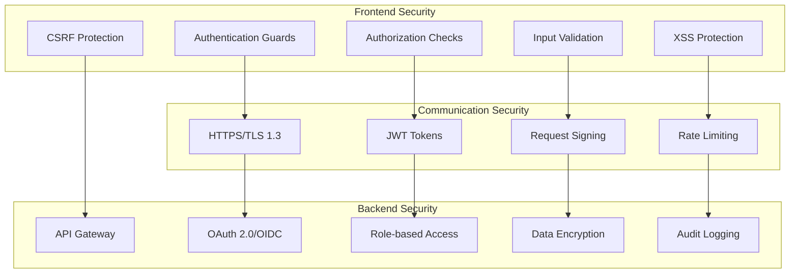

# Security Framework

> Comprehensive security architecture ensuring Matrix Portal meets enterprise-grade security requirements with defense-in-depth strategies.

## 🛡️ Security Architecture Overview

Matrix Portal implements a multi-layered security approach with authentication, authorization, data protection, and audit capabilities built into every component.

### Security Layers



## 🔐 Authentication Framework

### JWT Token Management

Matrix Portal uses JWT tokens for secure authentication with automatic refresh and secure storage.

```typescript
@Injectable({ providedIn: 'root' })
export class AuthService {
  private http = inject(HttpClient);
  private router = inject(Router);
  private secureStorage = inject(SecureStorageService);
  
  // Authentication state
  private _isAuthenticated = signal(false);
  private _currentUser = signal<User | null>(null);
  private _userPermissions = signal<Permission[]>([]);
  
  // Public readonly signals
  readonly isAuthenticated = this._isAuthenticated.asReadonly();
  readonly currentUser = this._currentUser.asReadonly();
  readonly userPermissions = this._userPermissions.asReadonly();
  
  // Token management
  private accessToken: string | null = null;
  private refreshToken: string | null = null;
  private tokenExpirationTimer: number | null = null;
  
  constructor() {
    this.initializeAuthState();
  }
  
  private initializeAuthState(): void {
    const storedTokens = this.secureStorage.getTokens();
    if (storedTokens?.accessToken) {
      this.setTokens(storedTokens.accessToken, storedTokens.refreshToken);
      this.loadUserProfile();
    }
  }
  
  async login(credentials: LoginCredentials): Promise<AuthResult> {
    try {
      const response = await firstValueFrom(
        this.http.post<LoginResponse>('/api/auth/login', credentials)
      );
      
      this.setTokens(response.accessToken, response.refreshToken);
      await this.loadUserProfile();
      
      return { success: true, user: this.currentUser() };
    } catch (error) {
      throw new AuthError('Login failed', error);
    }
  }
  
  async loginWithSSO(provider: 'google' | 'microsoft' | 'okta'): Promise<AuthResult> {
    try {
      // Redirect to SSO provider
      const ssoUrl = await this.getSSOUrl(provider);
      window.location.href = ssoUrl;
      
      // This method will complete after redirect back
      return { success: true };
    } catch (error) {
      throw new AuthError('SSO login failed', error);
    }
  }
  
  async logout(): Promise<void> {
    try {
      if (this.refreshToken) {
        await firstValueFrom(
          this.http.post('/api/auth/logout', { refreshToken: this.refreshToken })
        );
      }
    } catch (error) {
      console.warn('Logout API call failed:', error);
    } finally {
      this.clearAuthState();
      this.router.navigate(['/login']);
    }
  }
  
  async refreshTokens(): Promise<boolean> {
    if (!this.refreshToken) {
      return false;
    }
    
    try {
      const response = await firstValueFrom(
        this.http.post<RefreshResponse>('/api/auth/refresh', {
          refreshToken: this.refreshToken
        })
      );
      
      this.setTokens(response.accessToken, response.refreshToken);
      return true;
    } catch (error) {
      this.clearAuthState();
      return false;
    }
  }
  
  private setTokens(accessToken: string, refreshToken: string): void {
    this.accessToken = accessToken;
    this.refreshToken = refreshToken;
    
    // Store securely
    this.secureStorage.setTokens({ accessToken, refreshToken });
    
    // Set up automatic refresh
    this.scheduleTokenRefresh(accessToken);
    
    this._isAuthenticated.set(true);
  }
  
  private scheduleTokenRefresh(token: string): void {
    const payload = this.parseJWT(token);
    const expirationTime = payload.exp * 1000;
    const refreshTime = expirationTime - (5 * 60 * 1000); // 5 minutes before expiry
    const timeout = refreshTime - Date.now();
    
    if (this.tokenExpirationTimer) {
      clearTimeout(this.tokenExpirationTimer);
    }
    
    if (timeout > 0) {
      this.tokenExpirationTimer = window.setTimeout(() => {
        this.refreshTokens();
      }, timeout);
    }
  }
  
  private async loadUserProfile(): Promise<void> {
    try {
      const user = await firstValueFrom(
        this.http.get<User>('/api/auth/profile')
      );
      
      const permissions = await firstValueFrom(
        this.http.get<Permission[]>('/api/auth/permissions')
      );
      
      this._currentUser.set(user);
      this._userPermissions.set(permissions);
    } catch (error) {
      console.error('Failed to load user profile:', error);
      this.clearAuthState();
    }
  }
  
  private clearAuthState(): void {
    this.accessToken = null;
    this.refreshToken = null;
    this._isAuthenticated.set(false);
    this._currentUser.set(null);
    this._userPermissions.set([]);
    
    this.secureStorage.clearTokens();
    
    if (this.tokenExpirationTimer) {
      clearTimeout(this.tokenExpirationTimer);
      this.tokenExpirationTimer = null;
    }
  }
  
  getAccessToken(): string | null {
    return this.accessToken;
  }
  
  private parseJWT(token: string): any {
    try {
      const base64Payload = token.split('.')[1];
      const payload = atob(base64Payload);
      return JSON.parse(payload);
    } catch (error) {
      throw new Error('Invalid JWT token');
    }
  }
  
  private async getSSOUrl(provider: string): Promise<string> {
    const response = await firstValueFrom(
      this.http.get<{ url: string }>(`/api/auth/sso/${provider}`)
    );
    return response.url;
  }
}
```

### Secure Storage Service

```typescript
@Injectable({ providedIn: 'root' })
export class SecureStorageService {
  private readonly TOKEN_KEY = 'matrix_portal_tokens';
  private readonly ENCRYPTION_KEY = 'matrix_portal_encryption_key';
  
  setTokens(tokens: { accessToken: string; refreshToken: string }): void {
    try {
      const encrypted = this.encrypt(JSON.stringify(tokens));
      sessionStorage.setItem(this.TOKEN_KEY, encrypted);
    } catch (error) {
      console.error('Failed to store tokens securely:', error);
    }
  }
  
  getTokens(): { accessToken: string; refreshToken: string } | null {
    try {
      const encrypted = sessionStorage.getItem(this.TOKEN_KEY);
      if (!encrypted) return null;
      
      const decrypted = this.decrypt(encrypted);
      return JSON.parse(decrypted);
    } catch (error) {
      console.error('Failed to retrieve tokens:', error);
      this.clearTokens();
      return null;
    }
  }
  
  clearTokens(): void {
    sessionStorage.removeItem(this.TOKEN_KEY);
    localStorage.removeItem(this.TOKEN_KEY);
  }
  
  private encrypt(text: string): string {
    // Simple encryption for demo - use crypto-js or Web Crypto API in production
    return btoa(text);
  }
  
  private decrypt(encryptedText: string): string {
    return atob(encryptedText);
  }
}
```

## 🔒 Authorization System

### Role-Based Access Control (RBAC)

```typescript
// Permission model
interface Permission {
  id: string;
  resource: string;
  actions: string[];
  conditions?: Record<string, any>;
}

interface Role {
  id: string;
  name: string;
  description: string;
  permissions: Permission[];
}

interface User {
  id: string;
  email: string;
  name: string;
  roles: Role[];
  organizationId: string;
}
```

### Authorization Service

```typescript
@Injectable({ providedIn: 'root' })
export class AuthorizationService {
  private authService = inject(AuthService);
  
  // Check if user has permission for specific action
  hasPermission(resource: string, action: string, context?: any): boolean {
    const permissions = this.authService.userPermissions();
    
    return permissions.some(permission => {
      // Check resource match
      if (permission.resource !== resource && permission.resource !== '*') {
        return false;
      }
      
      // Check action match
      if (!permission.actions.includes(action) && !permission.actions.includes('*')) {
        return false;
      }
      
      // Check conditions if provided
      if (permission.conditions && context) {
        return this.evaluateConditions(permission.conditions, context);
      }
      
      return true;
    });
  }
  
  // Check if user has any of the specified roles
  hasRole(roleNames: string | string[]): boolean {
    const user = this.authService.currentUser();
    if (!user) return false;
    
    const roles = Array.isArray(roleNames) ? roleNames : [roleNames];
    return user.roles.some(role => roles.includes(role.name));
  }
  
  // Check if user can access specific organization data
  canAccessOrganization(organizationId: string): boolean {
    const user = this.authService.currentUser();
    if (!user) return false;
    
    // Super admin can access all organizations
    if (this.hasRole('super_admin')) return true;
    
    // Regular users can only access their own organization
    return user.organizationId === organizationId;
  }
  
  // Get filtered permissions for a resource
  getResourcePermissions(resource: string): Permission[] {
    const permissions = this.authService.userPermissions();
    return permissions.filter(p => p.resource === resource || p.resource === '*');
  }
  
  private evaluateConditions(conditions: Record<string, any>, context: any): boolean {
    // Implement condition evaluation logic
    // Example: { "organizationId": "{{ user.organizationId }}" }
    for (const [key, value] of Object.entries(conditions)) {
      if (!this.evaluateCondition(key, value, context)) {
        return false;
      }
    }
    return true;
  }
  
  private evaluateCondition(key: string, expectedValue: any, context: any): boolean {
    const actualValue = this.getContextValue(key, context);
    return actualValue === expectedValue;
  }
  
  private getContextValue(path: string, context: any): any {
    return path.split('.').reduce((obj, key) => obj?.[key], context);
  }
}
```

---

*Continue with [Deployment Architecture](deployment.md) to understand infrastructure security and deployment strategies, or explore the [API Reference](../api-reference/README.md) for secure API integration patterns.*

## Authorization
- **Role-Based Access Control (RBAC)**: Fine-grained access policies for users and services.
- **Resource-Based Authorization**: Control access at the resource level.
- **Scope Validation**: Enforce least-privilege access.
- **Claims Transformation**: Custom claims for advanced scenarios.

## Data Protection
- **Encryption**: Data encrypted at rest and in transit.
- **Key Management**: Secure key storage using Azure Key Vault.
- **Audit Logging**: Track access and changes for compliance.

## Best Practices
- Regularly review and update access policies.
- Use managed identity and secret management solutions.
- Monitor security events and set up alerts for suspicious activity.
- Perform regular security testing and vulnerability assessments.
