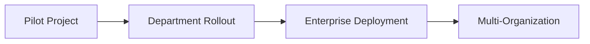
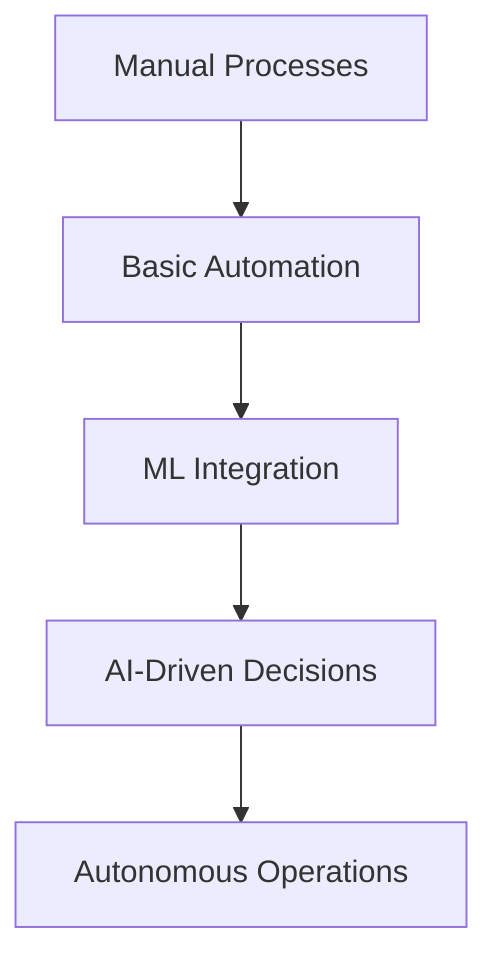

# # Use Cases & Applications

> Real-world applications and business scenarios where Matrix Portal delivers transformative value.

## 🏢 Enterprise Use Cases

### 1. Customer Service Automation

#### Challenge
Organizations struggle with high-volume customer inquiries, inconsistent responses, and 24/7 support requirements.

#### Matrix Portal Solution
- **Intelligent Agent Deployment** - Deploy specialized customer service agents
- **Multi-Channel Integration** - Connect to chat, email, phone, and social platforms
- **Escalation Management** - Seamless handoff to human agents when needed
- **Performance Analytics** - Track resolution times and customer satisfaction

#### Business Impact
- **60% reduction** in response time
- **40% decrease** in support costs
- **85% customer satisfaction** improvement
- **24/7 availability** without additional staffing

```typescript
// Example: Customer Service Agent Configuration
const customerServiceAgent = {
  name: "CustomerSupportBot",
  capabilities: ["faq", "order_tracking", "product_info", "escalation"],
  integrations: ["zendesk", "salesforce", "slack"],
  parameters: {
    tone: "friendly_professional",
    maxSessionDuration: 1800000, // 30 minutes
    escalationThreshold: 0.3
  }
};
```

### 2. Financial Risk Assessment

#### Challenge
Financial institutions need real-time risk assessment for loans, trading, and compliance monitoring.

#### Matrix Portal Solution
- **Real-time Model Deployment** - Deploy credit scoring and risk models
- **Multi-Source Data Integration** - Combine internal and external data sources
- **Regulatory Compliance** - Built-in audit trails and compliance reporting
- **A/B Testing Framework** - Continuously optimize risk models

#### Business Impact
- **30% improvement** in risk prediction accuracy
- **50% faster** loan approval processes
- **90% reduction** in compliance reporting time
- **25% decrease** in default rates

### 3. Healthcare Diagnosis Support

#### Challenge
Healthcare providers need AI assistance for diagnosis while maintaining patient privacy and regulatory compliance.

#### Matrix Portal Solution
- **HIPAA-Compliant Infrastructure** - Secure handling of patient data
- **Medical Image Analysis** - Deploy computer vision models for radiology
- **Clinical Decision Support** - Evidence-based recommendation engines
- **Audit Trail Management** - Complete traceability for regulatory compliance

#### Business Impact
- **35% improvement** in diagnostic accuracy
- **20% reduction** in diagnosis time
- **Full HIPAA compliance** with automated audit trails
- **Enhanced patient outcomes** through early detection

## 🛒 Retail & E-commerce

### 4. Personalized Recommendation Engine

#### Challenge
E-commerce platforms struggle to provide relevant product recommendations that drive sales and customer engagement.

#### Matrix Portal Solution
- **Behavioral Analytics** - Track user interactions and preferences
- **Multi-Model Ensemble** - Combine collaborative and content filtering
- **Real-time Adaptation** - Update recommendations based on current session
- **A/B Testing** - Optimize recommendation algorithms continuously

#### Business Impact
- **45% increase** in click-through rates
- **30% higher** average order value
- **25% improvement** in customer retention
- **Real-time personalization** at scale

### 5. Inventory Optimization

#### Challenge
Retailers need to optimize inventory levels across multiple locations while minimizing stockouts and overstock.

#### Matrix Portal Solution
- **Demand Forecasting** - ML models for sales prediction
- **Supply Chain Integration** - Connect with suppliers and logistics providers
- **Multi-Location Optimization** - Coordinate inventory across stores/warehouses
- **Automated Replenishment** - Trigger orders based on predicted demand

#### Business Impact
- **20% reduction** in inventory carrying costs
- **35% decrease** in stockouts
- **15% improvement** in profit margins
- **Automated decision-making** for 80% of SKUs

## 🏭 Manufacturing & Operations

### 6. Predictive Maintenance

#### Challenge
Manufacturing companies face unexpected equipment failures leading to costly downtime and production delays.

#### Matrix Portal Solution
- **IoT Data Integration** - Connect sensors and monitoring equipment
- **Anomaly Detection** - ML models for early failure prediction
- **Maintenance Scheduling** - Optimize maintenance windows and resources
- **Root Cause Analysis** - Automated failure analysis and recommendations

#### Business Impact
- **40% reduction** in unplanned downtime
- **25% decrease** in maintenance costs
- **30% improvement** in equipment utilization
- **Predictive insights** with 95% accuracy

### 7. Quality Control Automation

#### Challenge
Manual quality inspection is time-consuming, inconsistent, and cannot scale with production volumes.

#### Matrix Portal Solution
- **Computer Vision Models** - Automated visual inspection systems
- **Real-time Processing** - Inline quality assessment during production
- **Defect Classification** - Categorize and track quality issues
- **Process Optimization** - Identify and correct quality bottlenecks

#### Business Impact
- **60% faster** quality inspection
- **80% reduction** in defect escape rates
- **50% decrease** in inspection labor costs
- **Consistent quality standards** across all shifts

## 💰 Financial Services

### 8. Fraud Detection & Prevention

#### Challenge
Financial institutions face sophisticated fraud attempts requiring real-time detection without impacting customer experience.

#### Matrix Portal Solution
- **Real-time Transaction Monitoring** - Millisecond fraud detection
- **Behavioral Biometrics** - User behavior pattern analysis
- **Multi-Factor Risk Assessment** - Combine multiple risk indicators
- **Adaptive Learning** - Models that evolve with new fraud patterns

#### Business Impact
- **70% reduction** in fraud losses
- **90% decrease** in false positives
- **Sub-second** transaction processing
- **Enhanced customer trust** through security

### 9. Algorithmic Trading

#### Challenge
Investment firms need sophisticated trading algorithms that can adapt to market conditions and execute at high frequency.

#### Matrix Portal Solution
- **High-Frequency Model Deployment** - Microsecond decision making
- **Market Data Integration** - Real-time feeds from multiple exchanges
- **Risk Management** - Automated position sizing and stop-loss
- **Performance Analytics** - Strategy optimization and backtesting

#### Business Impact
- **35% improvement** in trading returns
- **60% reduction** in execution costs
- **Real-time risk management** with automated controls
- **24/7 market monitoring** and execution

## 🎓 Education & Research

### 10. Adaptive Learning Platforms

#### Challenge
Educational institutions need personalized learning experiences that adapt to individual student needs and learning styles.

#### Matrix Portal Solution
- **Learning Analytics** - Track student progress and engagement
- **Content Recommendation** - Personalized curriculum pathways
- **Assessment Automation** - Intelligent testing and feedback
- **Performance Prediction** - Early intervention for at-risk students

#### Business Impact
- **40% improvement** in learning outcomes
- **50% increase** in course completion rates
- **Personalized education** for every student
- **Data-driven** curriculum optimization

### 11. Research Data Analysis

#### Challenge
Research institutions handle massive datasets requiring sophisticated analysis while ensuring reproducibility and collaboration.

#### Matrix Portal Solution
- **Data Pipeline Automation** - ETL for research datasets
- **Collaborative Analytics** - Shared models and experiments
- **Reproducible Research** - Version control for models and data
- **Publication Support** - Automated report generation

#### Business Impact
- **60% faster** research cycles
- **Enhanced collaboration** across institutions
- **Reproducible results** with full audit trails
- **Accelerated** time to publication

## 🏥 Healthcare & Life Sciences

### 12. Drug Discovery Acceleration

#### Challenge
Pharmaceutical companies need to accelerate drug discovery while managing massive datasets and complex molecular relationships.

#### Matrix Portal Solution
- **Molecular Analysis** - AI models for compound screening
- **Clinical Trial Optimization** - Patient matching and trial design
- **Regulatory Compliance** - FDA-compliant data management
- **Collaboration Platform** - Cross-functional team coordination

#### Business Impact
- **50% reduction** in discovery timeline
- **30% decrease** in research costs
- **Higher success rates** in clinical trials
- **Faster** regulatory approval processes

### 13. Population Health Management

#### Challenge
Healthcare systems need to monitor and improve population health outcomes while managing costs and resources.

#### Matrix Portal Solution
- **Health Data Integration** - Combine EHR, claims, and social determinants
- **Risk Stratification** - Identify high-risk populations
- **Intervention Planning** - Data-driven health programs
- **Outcome Tracking** - Measure program effectiveness

#### Business Impact
- **25% improvement** in health outcomes
- **20% reduction** in healthcare costs
- **Proactive care** for high-risk patients
- **Data-driven** public health decisions

## 🚀 Technology Enablement Patterns

### Common Implementation Patterns

#### 1. MVP to Enterprise Scale


#### 2. Data Maturity Journey


#### 3. Integration Strategies
- **API-First Approach** - Seamless integration with existing systems
- **Microservices Architecture** - Gradual adoption without disruption
- **Cloud-Native Deployment** - Scalable and resilient infrastructure
- **Security-by-Design** - Built-in compliance and governance

### Success Factors

#### Technical Success Factors
- **Data Quality** - Clean, consistent, and accessible data
- **Model Governance** - Proper versioning and lifecycle management
- **Monitoring & Alerting** - Proactive issue detection and resolution
- **Scalable Architecture** - Ability to handle growing demand

#### Organizational Success Factors
- **Executive Sponsorship** - Leadership commitment and vision
- **Cross-Functional Teams** - Collaboration between IT and business
- **Change Management** - Proper training and adoption strategies
- **Continuous Improvement** - Iterative enhancement and optimization

### ROI Measurement Framework

#### Quantitative Metrics
- **Cost Reduction** - Direct savings from automation
- **Revenue Generation** - New opportunities and optimization
- **Efficiency Gains** - Time savings and productivity improvements
- **Risk Mitigation** - Avoided costs and compliance benefits

#### Qualitative Benefits
- **Innovation Capability** - Faster experimentation and deployment
- **Competitive Advantage** - Market differentiation and positioning
- **Employee Satisfaction** - Reduced mundane tasks and skill development
- **Customer Experience** - Improved service quality and responsiveness

---

*Ready to implement your use case? Start with our [Platform Overview](README.md) or explore the [Architecture Overview](../architecture/README.md) for technical planning.*

- Enterprise AI agent management
- Automated data processing
- Knowledge integration

(Add more use cases relevant to your platform.)
